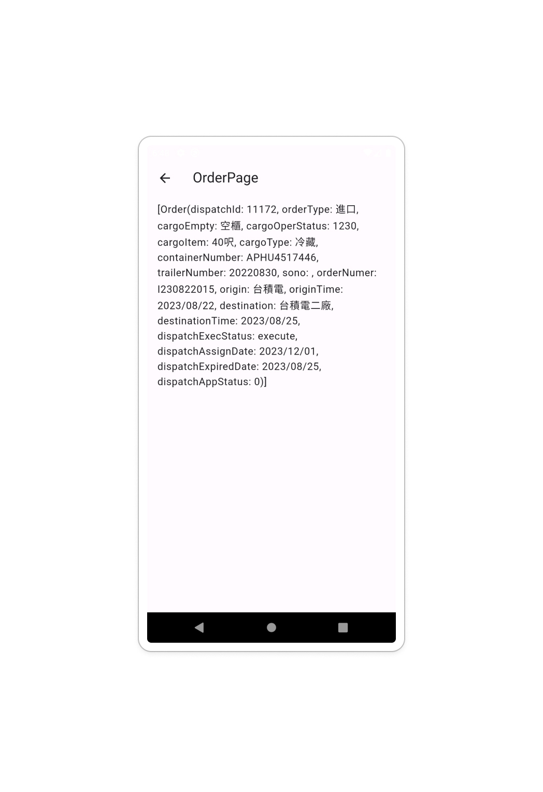

# freezed_test

**2024-05-13 edit by zhJackey**

## 1. :mag_right: 什麼是Freezed

當你正在從後端撈資料進到你的專案的時候有可能會遇上算是複雜的資料組如下
```json
//以下資料皆為虛構
{
    "dispatch_id": 11172,
    "order_type": "進口",
    "cargo_empty": "空櫃",
    "cargo_oper_status": "1230",
    "cargo_item": "40呎",
    "cargo_type": "冷藏",
    "container_number": "APHU4517446",
    "trailer_number": "20220830",
    "sono": "",
    "order_numer": "I230822015",
    "origin": "台積電",
    "origin_time": "2023/08/22",
    "destination": "台積電二廠",
    "destination_time": "2023/08/25",
    "dispatch_exec_status": "execute",
    "dispatch_assign_date": "2023/12/01",
    "dispatch_expired_date": "2023/08/25",
    "dispatch_app_status": 0,
},
```
那你在專案當中要進行資料存取時就會變成需要使用大量Code去建立如下

```dart
class Order {
  final int dispatchId;
  final String orderType;
  final String cargoEmpty;
  final String cargoOperStatus;
  final String cargoItem;
  final String cargoType;
  final String containerNumber;
  final String trailerNumber;
  final String sono;
  final String orderNumber;
  final String origin;
  final String originTime;
  final String destination;
  final String destinationTime;
  final String dispatchExecStatus;
  final String dispatchAssignDate;
  final String dispatchExpiredDate;
  final int dispatchAppStatus;

  Order({
    required this.dispatchId,
    required this.orderType,
    required this.cargoEmpty,
    required this.cargoOperStatus,
    required this.cargoItem,
    required this.cargoType,
    required this.containerNumber,
    required this.trailerNumber,
    required this.sono,
    required this.orderNumber,
    required this.origin,
    required this.originTime,
    required this.destination,
    required this.destinationTime,
    required this.dispatchExecStatus,
    required this.dispatchAssignDate,
    required this.dispatchExpiredDate,
    required this.dispatchAppStatus,
  });

  factory Order.fromJson(Map<String, dynamic> json) {
    return Order(
      dispatchId: json['dispatch_id'],
      orderType: json['order_type'],
      cargoEmpty: json['cargo_empty'],
      cargoOperStatus: json['cargo_oper_status'],
      cargoItem: json['cargo_item'],
      cargoType: json['cargo_type'],
      containerNumber: json['container_number'],
      trailerNumber: json['trailer_number'],
      sono: json['sono'] ?? '',
      orderNumber: json['order_numer'],  
      origin: json['origin'],
      originTime: json['origin_time'],
      destination: json['destination'],
      destinationTime: json['destination_time'],
      dispatchExecStatus: json['dispatch_exec_status'],
      dispatchAssignDate: json['dispatch_assign_date'],
      dispatchExpiredDate: json['dispatch_expired_date'],
      dispatchAppStatus: json['dispatch_app_status'],
    );
  }

  Map<String, dynamic> toJson() {
    return {
      'dispatch_id': dispatchId,
      'order_type': orderType,
      'cargo_empty': cargoEmpty,
      'cargo_oper_status': cargoOperStatus,
      'cargo_item': cargoItem,
      'cargo_type': cargoType,
      'container_number': containerNumber,
      'trailer_number': trailerNumber,
      'sono': sono,
      'order_numer': orderNumber, 
      'origin': origin,
      'origin_time': originTime,
      'destination': destination,
      'destination_time': destinationTime,
      'dispatch_exec_status': dispatchExecStatus,
      'dispatch_assign_date': dispatchAssignDate,
      'dispatch_expired_date': dispatchExpiredDate,
      'dispatch_app_status': dispatchAppStatus,
    };
  }
}
```
所以為了要把Code量簡化因此Freezed就是為這個而生的，對於剛剛的內容Freezed只需以下Code即可完成

```dart
// To parse this JSON data, do
//
//     final order = orderFromJson(jsonString);

import 'package:freezed_annotation/freezed_annotation.dart';
import 'dart:convert';

part 'order.freezed.dart';
part 'order.g.dart';

Order orderFromJson(String str) => Order.fromJson(json.decode(str));

String orderToJson(Order data) => json.encode(data.toJson());

@freezed
class Order with _$Order {
    const factory Order({
        @JsonKey(name: "dispatch_id")
        required int dispatchId,
        @JsonKey(name: "order_type")
        required String orderType,
        @JsonKey(name: "cargo_empty")
        required String cargoEmpty,
        @JsonKey(name: "cargo_oper_status")
        required String cargoOperStatus,
        @JsonKey(name: "cargo_item")
        required String cargoItem,
        @JsonKey(name: "cargo_type")
        required String cargoType,
        @JsonKey(name: "container_number")
        required String containerNumber,
        @JsonKey(name: "trailer_number")
        required String trailerNumber,
        @JsonKey(name: "sono")
        required String sono,
        @JsonKey(name: "order_numer")
        required String orderNumer,
        @JsonKey(name: "origin")
        required String origin,
        @JsonKey(name: "origin_time")
        required String originTime,
        @JsonKey(name: "destination")
        required String destination,
        @JsonKey(name: "destination_time")
        required String destinationTime,
        @JsonKey(name: "dispatch_exec_status")
        required String dispatchExecStatus,
        @JsonKey(name: "dispatch_assign_date")
        required String dispatchAssignDate,
        @JsonKey(name: "dispatch_expired_date")
        required String dispatchExpiredDate,
        @JsonKey(name: "dispatch_app_status")
        required int dispatchAppStatus,
    }) = _Order;

    factory Order.fromJson(Map<String, dynamic> json) => _$OrderFromJson(json);
}

```

接下來會展示如何**下載**以及**如何使用**以及**簡易範例** 

## :package: 安裝Freezed

### 1. [Freezed](https://pub.dev/packages/freezed) :link:

* 請依照文檔的安裝提示

        flutter pub add freezed_annotation
        flutter pub add dev:build_runner
        flutter pub add dev:freezed
        # if using freezed to generate fromJson/toJson, also add:
        flutter pub add json_annotation
        flutter pub add dev:json_serializable

自動生成的插件

### 2. [build_runner](https://pub.dev/packages/build_runner) :link:

為了要讓freezed能夠自動幫你生成json請一下要安裝

### 3. [json_annotation](https://pub.dev/packages/json_annotation/install) :link:
### 4. [json_serializable](https://pub.dev/packages/json_serializable) :link:

## :hammer: 如何使用

第一步: 編寫模型組

先在任意位置創建接下來會用到的數據模型檔案

接著簡單建立模型

```dart
import 'package:freezed_annotation/freezed_annotation.dart';

//freezed專屬覆寫
@freezed
//必須使用with + _ + $ + 數據模型名稱以辨別
class CountData with _$CountData {
  //必須使用factory
  const factory CountData({
    required int count,
  }) = _CountData;

  //假如需要fromJson，可以自動生成
  factory CountData.fromJson(Map<String, dynamic> json) => _$CountDataFromJso(json);
}
```
第二步: 讓freezed知道是那些檔案要自動生成

> **切記**
> 一定要是檔案名稱，而不是class名稱

    part 'count_data.freezed.dart';
    part 'count_data.g.dart';

```dart
import 'package:freezed_annotation/freezed_annotation.dart';

part 'count_data.freezed.dart';
part 'count_data.g.dart';

//freezed專屬覆寫
@freezed
//必須使用with + _ + $ + 數據模型名稱以辨別
class CountData with _$CountData {
  //必須使用factory
  const factory CountData({
    required int count,
  }) = _CountData;

  //假如需要fromJson，可以自動生成
  factory CountData.fromJson(Map<String, dynamic> json) => _$CountDataFromJso(json);
}
```

第三步: CMD下指令

```
flutter pub run build_runner build --delete-conflicting-outputs
```
完成後會像這樣


第四步: 實際應用
這樣就完成了喔，接下來可以簡單塞值進去測試一下

```dart
import 'package:flutter/material.dart';
import 'package:freezed_test/model/count_data.dart';

class CountPage extends StatefulWidget {
  const CountPage({super.key});

  @override
  State<CountPage> createState() => _CountPageState();
}

class _CountPageState extends State<CountPage> {
  
  CountData countData = const CountData(count: 123);

  @override
  Widget build(BuildContext context) {
    return Scaffold(
      appBar: AppBar(
        title: const Text('CountPage'),
      ),
      body: Center(
        child: Text(countData.count.toString()),
      ),
    );
  }
}
```


## :dart: 簡單範例

就拿說明的當作範例吧

目標檔案

1. model/order_data.dart
2. model/order_data.freezed.dart
3. model/order_data.g.dart
4. views/orider_page.dart


